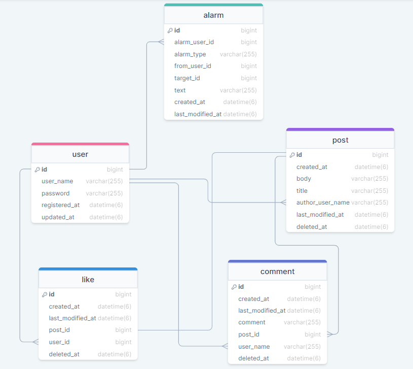
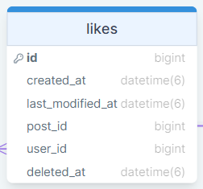
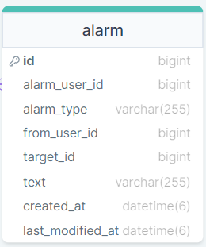

# 🚩 Swagger 주소

http://ec2-13-209-88-90.ap-northeast-2.compute.amazonaws.com:8080/swagger-ui/

# 📝 요구 사항 정의서

## 🛠 요구 기능

1. 모든 포스트에는 댓글을 달 수 있다. [O]
  - 댓글을 작성하는 기능 [O]
  - 댓글을 조회하는 기능 [O]
  - 댓글을 수정하는 기능 [O]
  - 댓글을 삭제하는 기능 [O]
2. 모든 포스트에는 좋아요를 누룰 수 있다 [O]
  - 좋아요를 누르는 기능 [O]
  - 포스트별로 눌린 좋아요의 개수를 보는 기능 [O]
3. 로그인한 유저는 자신이 작성한 포스트를 모아서 볼 수 있다. [O]
  - 모든 포스트 중 자신이 작성한 포스트만 모아서 조회하는 기능 [O]
4. 댓글이 달리거나 좋아요가 눌린 포스트의 작성자는 알람을 받아서 일시를 알 수 있다. [O]
5. 로그인하지 않았을 때 예외 발생, JSON 형태의 에러 내용을 출력하는 기능 [O]

## 📁 Entity Relationship Diagram



## 🧾 Endpoints

HTTP | Endpoint                            | 설명       |
--- |-------------------------------------|----------| 
POST | api/v1/posts/{postId}/comments      | 댓글 작성    |
GET | api/v1/posts/{postId}/comments      | 댓글 조회    |
PUT | api/v1/posts/{postId}/comments/{id} | 댓글 수정    |
DELETE | api/v1/posts/{postId}/comments/{id} | 댓글 삭제    |
GET | api/v1/posts/my                     | 마이 피드 조회 |
POST | api/v1/posts/{postId}/likes         | 좋아요 등록   |
GET | api/v1/alarms                       | 알람 조회    |

## 주의 사항
- 포스트는 삭제 시 실제 삭제가 되지 않고 ``Soft Delete`` 적용하여 ``deleted_at`` 컬럼에 날짜와 시간이 표시되도록 함 (``default`` 는 ``null``)

관련 글


## 중점 사항
##### 문서화, 이슈 관리, 관심사의 분리

# 🚀 구현


## 댓글 기능

### 1. ``POST`` api/v1/posts/{postId}/comments
- 댓글을 작성한다.

> 댓글 작성 성공 시

```json
{
	"resultCode": "SUCCESS",
	"result":{
		"id": 4,
		"comment": "comment test4",
		"userName": "test",
		"postId": 2,
		"createdAt": "2022-12-20T16:15:04.270741"
	}
}
```

> 댓글 작성 실패 시

1. 로그인 하지 않은 경우
2. 게시물이 존재하지 않는 경우

### 2. ``GET`` api/v1/posts/{postId}/comments
- 댓글을 조회한다.

> 댓글 조회 성공 시

```json
{
	"resultCode": "SUCCESS",
	"result":{
	"content":[
		{
		"id": 3,
		"comment": "comment test3",
		"userName": "test",
		"postId": 2,
		"createdAt": "2022-12-20T16:07:25.699346"
		},
		{
		"id": 2,
		"comment": "comment test2",
		"userName": "test",
		"postId": 2,
		"createdAt": "2022-12-20T16:03:30.670768"
		}
	],
	"pageable":{"sort":{"empty": false, "sorted": true, "unsorted": false }, 
	"offset": 0,…},
	"last": true,
	"totalPages": 1,
	"totalElements": 2,
	"size": 10,
	"number": 0,
	"sort":{
	"empty": false,
	"sorted": true,
	"unsorted": false
	},
	"numberOfElements": 2,
	"first": true,
	"empty": false
	}
}
```

### 3. ``PUT`` api/v1/posts/{postId}/comments/{id}
- 댓글을 수정한다.

> 댓글 수정 성공 시

```json
{
	"resultCode": "SUCCESS",
	"result":{
		"id": 4,
		"comment": "modify comment",
		"userName": "test",
		"postId": 2,
		"createdAt": "2022-12-20T16:15:04.270741"
		}
}
```

> 댓글 수정 실패 시

1. 인증 실패한 경우
2. 댓글이 존재하지 않는 경우
3. 작성자 불일치한 경우
4. 데이터베이스 에러가 난 경우

### 4. ``DELETE`` api/v1/posts/{postId}/comments/{id}
- 댓글을 삭제한다.

> 댓글 삭제 성공 시

```json
{
	"resultCode": "SUCCESS",
	"result":{
		"message": "댓글 삭제 완료",
		"id": 4
		}
}
```

> 댓글 삭제 실패 시: 댓글 수정 실패와 동일함.

## 마이 피드 기능


### 1. ``GET`` api/v1/posts/my
- 내가 (로그인된 사용자가) 작성한 포스트를 모두 조회한다.

> 마이피드 조회 성공 시:

```json
{
  "resultCode": "SUCCESS",
  "result":{
    "content":[
			{
			"id": 4,
			"title": "test",
			"body": "body",
			"userName": "test",
			"createdAt": "2022-12-16T16:50:37.515952"
			}
		],
	"pageable":{
			"sort":{"empty": true, "sorted": false, "unsorted": true }, "offset": 0,…},
			"last": true,
			"totalPages": 1,
			"totalElements": 1,
			"size": 20,
			"number": 0,
			"sort":{
			"empty": true,
			"sorted": false,
			"unsorted": true
			},
			"numberOfElements": 1,
	"first": true,
	"empty": false
}
```

> 마이피드 조회 실패 시:

1. 로그인 하지 않은 경우


## 좋아요 기능

### 1. ``POST`` /api/v1/posts/{postId}/likes
- 포스트에 좋아요를 등록한다.

좋아요를 나타내는 Like 엔티티는 다음과 같다:



> 좋아요 등록 성공 시

```json
{
	"resultCode":"SUCCESS",
	"result": "좋아요를 눌렀습니다."
}
```

> 좋아요 등록 실패 시

1. 로그인 하지 않은 경우
2. 호출 시 명시한 고유 아이디를 가진 포스트가 없는 경우


## 알람 기능

### 1. ``GET`` /api/v1/alarms
- 현재 로그인 된 사용자가 받은 알람을 모두 조회한다.

알람을 나타내는 Alarm 엔티티는 다음과 같다:



> 알람 목록 조회 성공 시

```json
{
  "resultCode":"SUCCESS",
  "result": {
  "content":
  [
    {
       "id": 1,
       "alarmType": "NEW_LIKE_ON_POST",
       "fromUserId": 1,
       "targetId": 1,
       "text": "new like!",
       "createdAt": "2022-12-25T14:53:28.209+00:00",
    }
  ]
  }
}
```

> 알람 목록 조회 실패 시

1. 로그인 하지 않은 경우


## 에러가 발생하는 경우의 JSON 응답 형태

1. 로그인하지 않은 채 인증이 필요한 API (마이피드, 포스트/댓글 작성, 알람 목록 조회) 를 호출했을 때 OR 자신이 작성하지 않은 포스트/댓글에 대해 수정/삭제를 하고자 할 때
```json
{
  "resultCode": "ERROR",
  "result": {
    "errorCode": "INVALID_PERMISSION",
    "message": "사용자가 권한이 없습니다."
  }
}
```

2. 존재하지 않는 포스트/댓글을 조회했을 때
```json
{
  "resultCode": "ERROR",
  "result": {
    "errorCode": "POST_NOT_FOUND",
    "message": "해당 포스트가 없습니다."
  }
}
```

```json
{
  "resultCode": "ERROR",
  "result": {
    "errorCode": "COMMENT_NOT_FOUND",
    "message": "해당 댓글이 없습니다."
  }
}
```

3. 포스트/댓글을 작성했던 사용자가 더 이상 회원으로 남아 있지 않을 때
```json
{
  "resultCode": "ERROR",
  "result": {
    "errorCode": "USERNAME_NOT_FOUND",
    "message": "해당 사용자 아이디가 없습니다."
  }
}
```


# 📢 2주차 미션 요약

- 아래는 1주차에 이어서 프로젝트를 진행하면서 실질적으로 변경한 부분들과 읽고 도움 받은 글들의 출처이다.

### 1. ``Auditing`` 적용 시 날짜/시간 데이터 형식 변경으로 초단위만큼만 DB 저장 및 JSON 출력되도록 변경:

> https://jworks.io/formatting-a-java-8-localdatetime-in-json-with-spring-boot/
>
> https://www.springcloud.io/post/2022-09/springboot-date-format/#gsc.tab=0
>
> https://mchch.tistory.com/165
>
> https://stackoverflow.com/questions/22463062/how-can-i-parse-format-dates-with-localdatetime-java-8

- DB 에서 눈으로 테이블의 레코드들을 확인해야 할 때가 있었는데, 이전에 비해 가독성이 향상되어 DB 를 확인할 때의 피로를 감소시킬 수 있었다.


### 2. 테스트 코드 리팩토링

- @ParameterizedTest 를 활용하여 여러 테스트 메서드에서 중복되는 부분을 매개 변수로 분리하고,<br>
  @MethodSource 에 정의한 메서드를 활용해 테스트 상황마다 필요한 매개 변수를 주입할 수 있도록 함

> https://www.baeldung.com/parameterized-tests-junit-5

``PostResponse``, ``CommentDeleteResponse`` 응답 DTO 에 인터페이스와 상속을 도입하여<br>
매개 변수가 없는 성공 테스트도 공통된 부분을 메서드로 분리할 수 있도록 변경.

> https://www.thoughtworks.com/insights/blog/composition-vs-inheritance-how-choose

- 반복되는 테스트 (성공 테스트 포함) 를 커스터마이징을 해서 좀 더 반복을 줄이고 빠르게 테스트를 작성할 수 있게 되었다.<br>
- ``PostServiceTest`` 의 포스트 수정과 삭제 실패 테스트의 개수 변경 전 6개 -> 변경 후 3개
- ``CommentServiceTest`` 의 댓글 수정과 삭제 실패 테스트의 개수 변경 전 6개 -> 변경 후 3개

> 테스트 코드 리팩토링 하기: https://itistori.tistory.com/51

### 3. 포스트/댓글/좋아요에 Soft Delete 적용
- Soft Delete 는 실제로 데이터가 삭제되지 않고 삭제 되었는지 여부를 나타내는 컬럼을 업데이트하는 방식으로 삭제를 꾸며내는 것을 말한다.

H2를 활용해 Soft Delete 가 실행되는지 확인하는 DB 테스트를 진행하기에 앞서 아래 글을 읽고 H2 DB 가 무엇인지 공부한 후 진행했다:

> h2란? :
> https://www.javatpoint.com/spring-boot-h2-database

- H2 를 사용해 DB 테스트를 진행하면서, ``referential Integrity Constraints failed`` 와 ``could not prepare statement``<br>
  두 개의 오류를 마주쳤다.

> 참조 무결성 문제 해결하기: [블로그 포스트 작성 예정]

> Prepare Statement 할 수 없는 이유:
> https://stackoverflow.com/questions/24060498/org-hibernate-exception-sqlgrammarexception-could-not-prepare-statement

> H2 에서 사용되는 예약어: http://www.h2database.com/html/advanced.html

> H2 활용해 Soft Delete 테스트하기: https://itistori.tistory.com/53

- H2를 활용한 DB 테스트를 진행해서 실제 기능을 구현하기 전에 어떤 동작을 목표로 기능이 구현되어야 하는지를 테스트 코드를 작성하여<br>
  개요를 짤 수 있었다.


### 4. 특정 API 주소는 인증 없이도 허용되게, 특정 API 는 인증 필요하게 만들기
- 특정 포스트 상세 조회, 특정 포스트의 댓글 조회, 특정 포스트의 좋아요 조회 시 공통적으로 postId 가 API 경로에 포함되어 있었다.<br>
  단순히 {postId} 로 작성한 후 의도한 대로 인증 요청이 되지 않아서 구글링을 한 결과, API URL 의 ``PathVariable`` 부분은<br>
  변수명만이 아니라 변수의 데이터형을 함께 ``regex`` (정규식) 으로 명시해주어야 한다는 것을 알 수 있었다.

> 정수형 @PathVariable 변수를 API 경로 내에서 정규식으로 표현하기:
> https://stackoverflow.com/questions/55863235/how-to-apply-spring-security-antmatchers-pattern-only-to-url-with-pathvariable

> 경로에 @PathVariable 포함하는 API 호출 시 인증 필요 여부 설정하기: https://itistori.tistory.com/50

## 궁금했던 점

- ``Comment`` 와 ``Post`` 의 관계를 identifying 로 할지 non-identifying 으로 할 지 고민이 된다. 각 포스트별로 달린 댓글의 순번을 정하는 게 더 상식적이다.
- 왜 API 경로 내의 정규식은 백슬래쉬가 두 개일까? 정수 표현: ``\\d+``
  - 원래 ``Java`` ``regex`` 에서는 정수 표현: ``\d`` 로 백슬래쉬가 하나이다.
- ``LikeEntity`` 엔티티를 서비스 내에서 빌더 패턴을 써서 만들어 사용하고 있는데, 서비스에서 직접 생성하는 것이 맞을까,<br>
  ``DDD(Domain Driven Development)`` 로 엔티티 내부에서 스스로를 생성하는 것이 적절할까?
- H2 테스트 시 테스트의 범위를 어디까지 생각하고 테스트 코드를 작성해야 하는지?
  - user 를 포함해야 하는지, post 와 like 만 포함하면 되는지
  - comment 를 테스트 해야 하는지

## 구현하고 싶은 점
- User 탈퇴를 구현해보고 싶다